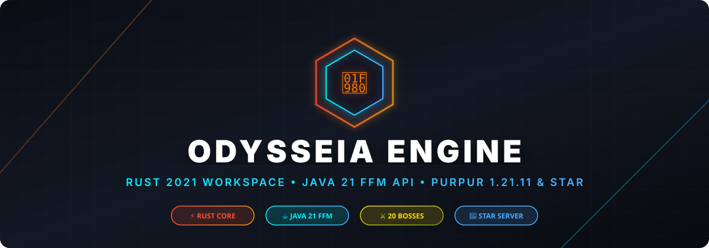

<div align="center">



# ✦ Odysseia Core Engine ✦

### The sovereign operational engine, transactional commerce gateway & server administration suite for DrakesCraft

[](https://papermc.io/)
[](https://purpurmc.org/)
[](https://openjdk.org/)
[](https://www.rust-lang.org/)
[](./LICENSE)
[](https://web.drakescraft.cl)

**A high-performance Paper/Purpur 1.21.11 production core that centralizes transactional store fulfillment, cross-modality inventory isolation, multi-tier kit progression, automated server maintenance windows, anti-exploit rate limiters, and horror night environmental events.**

[🌐 Official Portal](https://web.drakescraft.cl) ·
[📖 Command Guide](https://web.drakescraft.cl/guia-comandos.html) ·
[🛒 Store Catalog](https://web.drakescraft.cl/store.html) ·
[🏛️ Ecosystem Repositories](https://github.com/DrakesCraft-Labs)

</div>

---

## 🏛️ What is Odysseia?

**Odysseia is the central execution plane of the DrakesCraft network.** Rather than a mere collection of utility commands or standalone mechanics, Odysseia orchestrates the critical server-side systems that require unified player identity (Java & Bedrock via Floodgate), strict economic security, zero-regression purchase fulfillment, and audit logging.

Built with a hybrid **Java 21 Bukkit Core** and an accompanying **Rust 2021 high-throughput calculation workspace**, Odysseia ensures that heavy processing, transaction persistence, and scheduled maintenance occur without dropping ticks on live production servers.

---

## ✨ Core Highlights

- **💳 Idempotent Purchase & Delivery Engine** — State-machine commerce processor connected to Tebex Headless API. Backed by transactional SQLite WAL storage; prevents double-claims, supports dry-run validation, offline queues, and automatic chargeback audits.
- **🎒 Cross-Modality & Inventory Isolation** — Enforces strict economic boundaries across Survival, SkyBlock, and OneBlock. Prevents cross-world storage exploits, item smuggling, and unauthorized backpack transfer.
- **👑 4-Band VIP Kit Architecture** — Granular progression for Mortal, Divine (Apollo, Athena, Ares, Poseidon, Hades, Zeus), and Titan ranks (Cronos, Atlas, Oceanus, Hyperion). Delivers production means (GEO drills, generators, ProtectionStones) without destabilizing the Slimefun economy.
- **🛡️ Anti-Exploit & Commerce Rate Limiters** — Protects against spawner hoarding, automatic clickers, rapid chest transaction duping, and market flooding through `CommerceCommandLimiter` and `CommerceRateLimiter`.
- **🔄 Safe Maintenance Windows (`/restart30`)** — 30-second automated countdown with global broadcast warnings, world flush, data persistence locks, and maintenance protection preventing player data loss during deployment.
- **🌫️ Horror Nights & Atmospheric Events** — Dynamically scheduled horror nights with ultra-dense custom fog (`/niebla`), Blood Moon celestial phases, screen screamers, and custom ambient soundtracks.
- **🐉 Private Dragon Mounts & Custom Cosmetics** — High-tier cosmetic particle wings, dragon mounts (JackStar Supreme, Kika Emerald), chat tags, visual claim borders, and interactive chat mini-games.
- **🦀 Rust Off-JVM Workspace** — Seven specialized native crates for pure rule processing, store primitives, horror algorithms, and operational telemetry without garbage collection pauses.

---

## 🗺️ Canonical DrakesCraft Plugin Ecosystem

Odysseia operates as the foundational core of a decoupled 4-pillar architectural ecosystem:

```
                      ┌─────────────────────────────────────────┐
                      │             ODYSSEIA CORE               │
                      │  (Tebex Engine, Kits, Isolation, Ops)  │
                      └───────┬─────────────┬─────────────┬─────┘
                              │             │             │
            ┌─────────────────┴─┐   ┌───────┴─────────┐   └─────────────────┐
            ▼                   ▼   ▼                 ▼                     ▼
 ┌───────────────────────┐ ┌───────────────────┐ ┌───────────────────┐ ┌────────────────────┐
 │     DIOSESDRAKES      │ │   DRAKESBOSSES    │ │   DRAKESARCANA    │ │  SLIMEFUN4-DRAKE   │
 │ Divine pantheons,     │ │ Instanced arenas, │ │ 6 elemental magic │ │ Hardened technical │
 │ favor accumulation &  │ │ Dragmas entry fee │ │ trees, meditation │ │ core, SQL storage  │
 │ convergence anchors   │ │ & mailbox delivery│ │ & spiritual codex │ │ & Networks backend │
 └───────────────────────┘ └───────────────────┘ └───────────────────┘ └────────────────────┘
```

| Plugin Repository | Role & Responsibilities |
|---|---|
| **`Odysseia`** *(This Repo)* | Central execution plane: Tebex gateway, kit deliveries, cross-modality security, `/restart30`, cosmetics, and admin tools. |
| **[`DiosesDrakes`](https://github.com/DrakesCraft-Labs/DiosesDrakes)** | Divine pantheon progression (Greek, Norse, Celtic, Egyptian, Hindu), favor mechanics, and public Convergence altars. |
| **[`DrakesBosses`](https://github.com/DrakesCraft-Labs/DrakesBosses)** | Isolated multi-phase boss arenas in `drakes_bosses`, Dragmas economy entry fees, and secure reward mailbox (`/buzon`). |
| **[`ArcanaDrakes`](https://github.com/DrakesCraft-Labs/ArcanaDrakes)** | Elemental magic paths (Fire, Water, Earth, Air, Ice, Lightning), meditation shrines, spell grimoire, and deity tuning. |

---

## 📊 Comprehensive Domain Capabilities

| Domain | Production Capabilities & Active Systems |
|---|---|
| **E-Commerce & Store** | Canonical catalog (`purchases.yml`), Tebex webhooks, transactional SQLite logging, stateful actions, dry-run preview, manual redeliveries, refund/chargeback audit logs. |
| **Player Identity** | Dual Java & Bedrock UUID/name resolution, Floodgate prefix support, offline player queuing, and multi-session tracking. |
| **Ranks & VIP Kits** | Tiered delivery (Initial, Monthly, One-Time), administrative testing mode, temporary SFMaster permissions with automated expiration monitoring. |
| **World & Modality** | Seamless routing between Survival, SkyBlock, and OneBlock; isolated player vaults; automated transfer locks on shulker boxes, backpacks, and Slimefun storages. |
| **Economic Guardrails** | Main GUI shop, `/sell` inventory evaluator, Papa de Mar merchant, dynamic rate limiters, anti-macro transaction throttling. |
| **Server Operations** | Zero-downtime maintenance windows, `/restart30` atomic saving protocol, internal operational telemetry reporting, VIP expiration Discord notices. |
| **Security & Auditing** | Anti-alt IP fingerprinting, AFK machine detection, spawner stacking limits, Fast Machines protection, corrupted item quarantines. |
| **Land Claims** | Direct API dispatch of ProtectionStones (from 49x49 to 2500x2500 blocks), visual claim boundary particles, alias resolution, WorldGuard flag enforcement. |
| **Community & Events** | Particle cosmetics (`/cosmeticos`), daily reward streaks, trivia chat games, custom death messages, store broadcast fanfare, private dragon summoning. |

---

## 💳 The Purchase & Delivery Engine

Odysseia treats store transactions as **strict state machines**, not arbitrary console commands:

```
[Tebex Webhook] ──> [Odysseia Gateway] ──> [Signature & Catalog Validation]
                                                       │
                                      ┌────────────────┴────────────────┐
                                      ▼                                 ▼
                             [Online Dispatch]                 [Offline SQLite Queue]
                                      │                                 │
                                      ▼                                 ▼
                         [Atomic Benefit Delivery]             [Player Join Listener]
                                      │                                 │
                                      └────────────────┬────────────────┘
                                                       ▼
                                         [Audit Log & Star Telemetry]
```

- **Idempotency**: Every transaction ID is recorded in SQLite WAL mode. Duplicate webhooks cannot grant rewards twice.
- **Atomic Actions**: Deliveries are decomposed into individual action records (e.g., `GIVE_RANK`, `DELIVER_KIT`, `CLAIM_STONE`). Partial failures can be retried independently without re-granting completed steps.
- **Fail-Safe Testing**: Administrators can execute `/drakestore testbuy <player> <product>` in `dry-run` mode to inspect all actions and permission trees before going live.

---

## 🛠️ Complete Command Reference

### Public Commands

| Command | Permission | Description |
|---|---|---|
| `/modalidad` | *Default* | Open the cross-modality travel menu (Survival, SkyBlock, OneBlock). |
| `/tienda` | *Default* | Access the server GUI shop and categories. |
| `/sell` | *Default* | Open the instant inventory sell chest. |
| `/kit [name]` | `odysseia.kit.<name>` | Claim available mortal, divine, or titan rank kits. |
| `/recompensa` | *Default* | Claim the daily login reward streak. |
| `/cosmeticos` | `odysseia.cosmetics` | Open the cosmetic wardrobe (particle trails, wings, crowns). |
| `/comprar` | *Default* | Display the official Tebex store link and promotion announcements. |
| `/ps bordes` | `odysseia.ps.borders` | Render glowing particle outlines around the current claim. |

### Staff & Administrative Commands

| Command | Permission | Description |
|---|---|---|
| `/restart30` | `odysseia.admin.restart` | Initiate the 30-second safe server reboot sequence with data flush. |
| `/drakestore redeliver <id>` | `odysseia.admin.store` | Force retry a pending or interrupted transaction. |
| `/drakestore testbuy <user> <item>` | `odysseia.admin.store` | Simulate a purchase delivery in dry-run mode without charging. |
| `/sfmaster <user> <duration>` | `odysseia.admin.sfmaster` | Grant timed temporary access to Slimefun Master cheat mode with logging. |
| `/niebla <on|off|toggle> [user]` | `odysseia.admin.events` | Toggle ultra-dense cinematic atmospheric fog. |
| `/meteorito <x> <z>` | `odysseia.admin.events` | Spawn a celestial meteor impact event with custom ores. |
| `/auradueno` | `odysseia.owner` | Activate the sovereign golden aura and invulnerability state. |
| `/odysseia reload` | `odysseia.admin` | Hot-reload YAML configurations and validate catalog integrity. |

---

## 🦀 Rust Workspace Architecture

In addition to the Java 21 plugin JAR, Odysseia features an experimental high-performance Rust 2021 workspace in `crates/`:

```
Odysseia-Rust/
├── Cargo.toml
├── crates/
│   ├── odysseia-core/        # Pure game rules, math, item hashing & calculations
│   ├── odysseia-store/       # Transaction state machine primitives & validation
│   ├── odysseia-automation/  # Off-JVM machine ticking and network topology
│   ├── odysseia-horror/      # Horror Night procedural algorithms & fog physics
│   ├── odysseia-telemetry/   # internal observability & metrics contracts
│   ├── odysseia-ffi/         # Native Java 21 Project Panama / FFM bindings
│   └── odysseia-server/      # Standalone microservice daemon (Tokio + Axum)
```

> **Runtime Safety Note**: The production Paper server runs 100% on the native Java engine. The Rust layer operates as an off-JVM sidecar/FFI calculation layer; if native binaries are absent, Odysseia automatically runs its pure Java fallback routines.

---

## 📦 Building & Testing

### Prerequisites
- **Java**: OpenJDK 21 or GraalVM 21
- **Maven**: 3.9+
- **Rust** *(Optional, for native crates)*: Rust 1.78+ / Cargo

### Build Commands

```bash
# 1. Clone repository
git clone https://github.com/DrakesCraft-Labs/Odysseia.git
cd Odysseia

# 2. Build Java Bukkit Plugin JAR
mvn clean package

# 3. Test Rust Workspace (Optional)
cargo test --workspace
```

The compiled plugin JAR will be located at `target/Odysseia-1.1.0.jar`.

---

## 🔌 Runtime Integrations

Odysseia bridges and synchronizes with industry-standard server components:

- **LuckPerms**: Group hierarchy inheritance, temporary parent expirations, and permission validation.
- **ProtectionStones & WorldGuard**: Territorial claim delivery, dimension flags, and boundary rendering.
- **EssentialsX**: Currency hooks, user meta, warp triggers, and legacy kit scheduling.
- **Slimefun4-Drake**: Research checks, SFMaster runtime oversight, and protected machine ticking.
- **Floodgate 2.0**: Seamless Bedrock Edition UUID translation and prefix handling.
- **DiscordSRV**: Live synchronization of staff alerts, store broadcasts, and server maintenance countdowns.
- **PlaceholderAPI**: Rich placeholders for rank tier, daily streaks, claim counts, and active events.

---

## 📜 License & Credits

- **Author & Maintainer**: **DrakesCraft Labs**
- **License**: [GPL-3.0](./LICENSE) — Open source, robust, and built for production.
- **Minecraft**: Compatible with Paper / Purpur 1.21.11.

<div align="center">

**Built with ☕, 🦀, and architectural rigor for DrakesCraft.**

</div>
